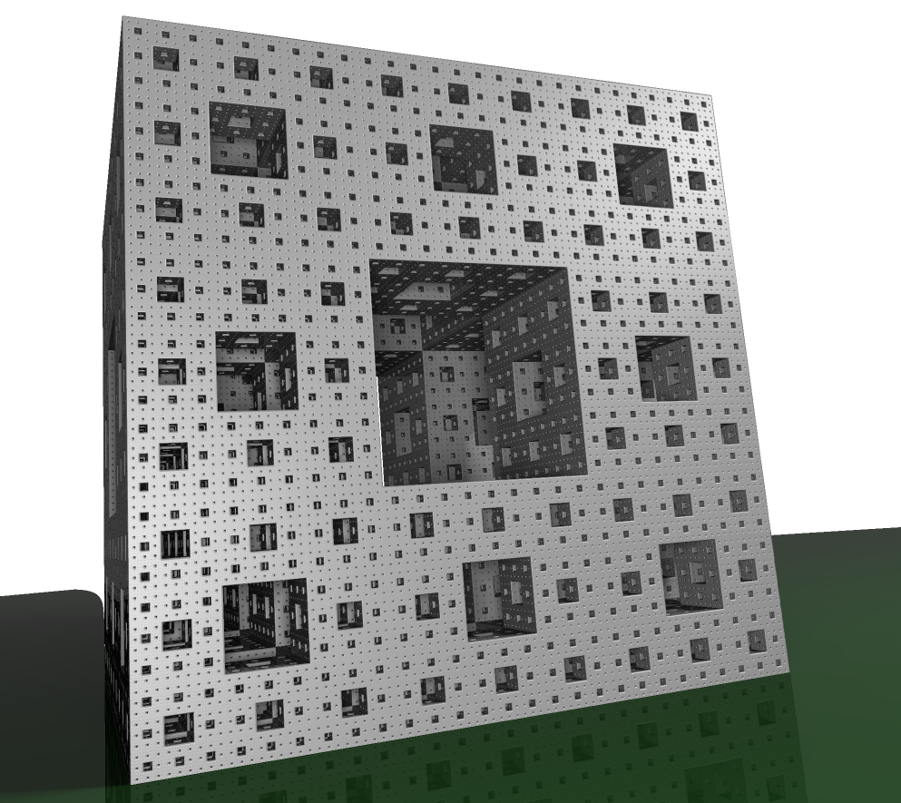

rt
==

Small fractal raytracer (raymarcher).

This is a school project created for course Computer Graphics at Brno University of Technology.
The authors of this code are: Radek Fer (me), Mira Skacel and Jirka Janda.

Features:
 * Two fractals implemented: Mengerspong and Mandelbulb
 * Dynamic DE thresholding
 * Antialiasing filter
 * Ambient occlusion
 * Soft shadows
 * Orbit trap coloring
 * Keyframe definition and animation framework -> can produce animations
 
This is just a small demo project, see [mandelbulber3d](http://www.mandelbulb.com/tag/mandelbulb-3d/), which is much better tool for 3d fractal exploration! 

